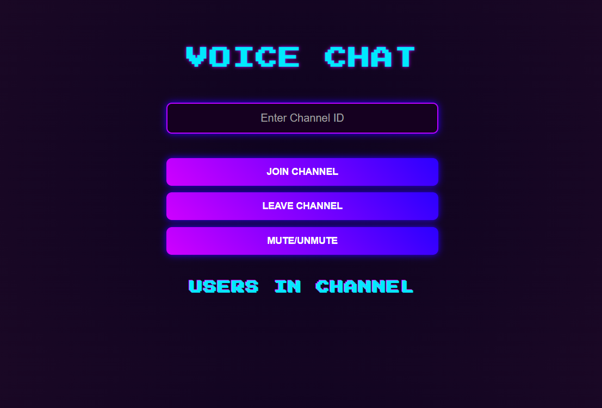
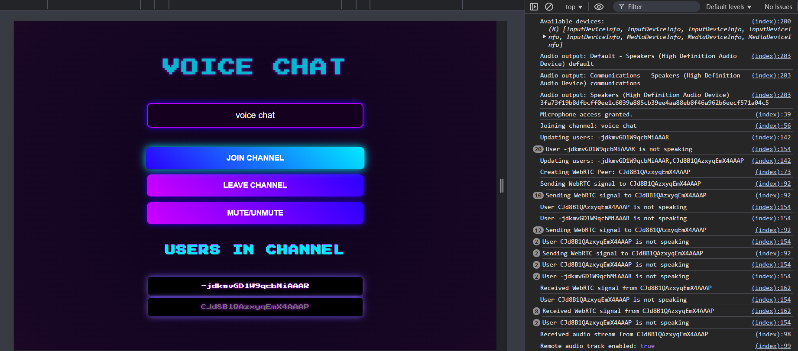
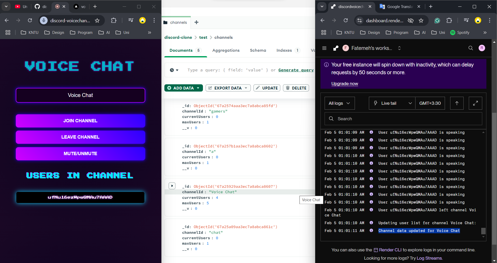

# discord-voice-channels

This project tries to simulate discord parrallel voice chat system
**Open Github to see the README images**

## Authors
- Fatemeh Reazaqnejad
- [Gmail](razaqnejad@gmail.com)
- [GitHub](https://github.com/razaqnejad)

## Course
Web Engineering by Dr. Zamaniyan - KNTU

## Important Links
- [Website URL (Client)](https://discord-voicechannels.vercel.app/)
- [Project's GitHub](https://github.com/razaqnejad/discord-voice-channels)
- [Server URL ](https://discordvoicechannels.onrender.com)

## How To Run The Projetc
- Simply open the [Website URL (Client)](https://discord-voicechannels.vercel.app/)
- Write a channel name and click "Join Channel"
- Give the website permission to acces to your microphone by clicking "While Using This Website"
- You will see the users in the channel including yourself
- Your "User ID" will highlight when you talk
- CLick "Mute/Unmute" to mute or unmute your mice
- Click "Leave Channel" if you want to left the voice chat

## Example Output

    

        

            <h4> Here you can see how does the overall website look like:</h4>
             
            
        

        

            <h4>All the actions happening on the server side are being described in the console log to make it easy to debug</h4>
            <ul>Information of the confined input device (Microphone)</ul>
            <ul>Information of the confined output device (Speakers)</ul>
            <ul>Inform to grant mics access</ul>
            <ul>Information of the channel user joined</ul>
            <ul>Information of the other users in the channel</ul>
            <ul>Information of speaking peers</ul>
            <ul>Information of transferring WebRTC signals</ul>
            <ul>Information of leaving users</ul>
            <ul>Inform to mute/unmute mics</ul>
            <ul>Inform to leave the channel</ul>
             
            
        

        

            <h4>For Analyzing users tastes, the channels information will be hekpt in database</h4>
             
            
        

    

